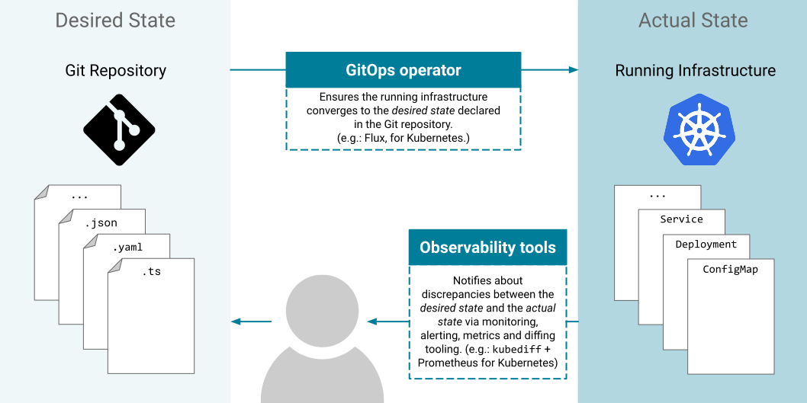

# Awesome-GitOps <!-- omit in toc -->

A curated list for awesome GitOps resources inspired by [@sindresorhus' awesome](https://github.com/sindresorhus/awesome)

We follow this [code of conduct](CODE-OF-CONDUCT.md).

## What is GitOps? <!-- omit in toc -->

GitOps is a way to do Kubernetes cluster management and application delivery.
It works by using [Git](https://git-scm.com/) as a single source of truth for
[declarative infrastructure and applications](https://en.wikipedia.org/wiki/Infrastructure_as_code),
together with tools ensuring the _actual state_ of infrastructure and
applications converges towards the _desired state_ declared in Git. With Git at
the center of your delivery pipelines, developers can make pull requests to
accelerate and simplify application deployments and operations tasks to your
infrastructure or container-orchestration system (e.g. [Kubernetes](https://kubernetes.io/)).

## Why is GitOps awesome? <!-- omit in toc -->

It [increases developer productivity](https://www.weave.works/technologies/gitops/#key-benefits), [enhances developer experience](https://www.weave.works/technologies/gitops/#key-benefits), [improves stability](https://www.weave.works/technologies/gitops/#key-benefits), all while having [higher reliability](https://www.weave.works/technologies/gitops/#key-benefits), [higher consistency](https://www.weave.works/technologies/gitops/#key-benefits) and [stronger security guarantees](https://www.weave.works/technologies/gitops/#key-benefits).

Modern software development practices _assume_ support for reviewing changes, tracking history, comparing versions, and rolling back bad updates; GitOps applies the same tooling and engineering perspective to managing the systems that deliver direct business value to users and customers.

<!-- toc -->

- [Background](#background)
- [Tools](#tools)
- [Ancillary Tools](#ancillary-tools)
  - [Notifications](#notifications)
  - [Secrets](#secrets)
- [Tutorials](#tutorials)
- [Community](#community)

<!-- tocstop -->

## Background

- [Operations by pull request](https://www.weave.works/blog/gitops-operations-by-pull-request) - a blog entry about how GitOps came about at Weaveworks
- [GitOps.tech](https://www.gitops.tech/) - a summary of how GitOps works
- [GitOps Conversation Kit](https://gitops-community.github.io/kit/) - How to showcase GitOps awesomeness and convince all stakeholders to implement it
- [GitOps Working Group](https://github.com/gitops-working-group/gitops-working-group) - GitHub repo of GitOps working group under the CNCF App Delivery SIG.

## Tools

- [ArgoCD](https://github.com/argoproj/argo-cd) - Declarative continuous deployment for Kubernetes
- [Atlantis](https://www.runatlantis.io/) - Terraform pull request automation
- [Autoapply](https://github.com/autoapply/autoapply) - Automatically apply changes from a Git repository to a Kubernetes cluster
- [CloudBees Rollout](https://rollout.io/) - Feature Flag as-a-Service that leverages GitOps & Config-as-Code (commercial product from CloudBees)
- [FluxCD](https://github.com/fluxcd/flux2) - The GitOps Kubernetes operator
- [Helm Operator](https://github.com/fluxcd/helm-operator) - Automates Helm Chart releases in a GitOps manner
- [Flagger](https://github.com/weaveworks/flagger) - Progressive delivery Kubernetes operator (Canary, A/B testing and Blue/Green deployments automation)
- [Ignite](https://github.com/weaveworks/ignite) - A Virtual Machine manager with a container UX and built-in GitOps
- [Faros](https://github.com/pusher/faros) - CRD based GitOps controller
- [Gitkube](https://gitkube.sh/) - Build and deploy docker images to Kubernetes using git push
- [Jenkins X](https://jenkins-x.io/) - a CI/CD platform for Kubernetes that provides pipeline automation, built-in GitOps and preview environments
- [KubeStack](https://www.kubestack.com/) - GitOps framework using Terraform for Cloud Kubernetes distros (AKS, GKE, and EKS) with CI/CD examples for common tools
- [Weave GitOps Core](https://www.weave.works/product/gitops-core/) - Weave GitOps Core is a free and open source continuous delivery product to run apps in any Kubernetes.
- [Weave Cloud](https://www.weave.works/product/cloud/) - GitOps experience, workflows and dashboard for your cluster(s) (commercial product from Weaveworks)
- [Werf](https://werf.io) - GitOps tool with advanced features to build images and deploy them to Kubernetes (integrates with any existing CI system)
- [PipeCD](https://pipecd.dev/) - Continuous Delivery for Declarative Kubernetes, Serverless and Infrastructure Applications

## Ancillary Tools

### Notifications

- [Fluxcloud](https://github.com/topfreegames/fluxcloud) - Slack notifications for FluxCD without Weave Cloud

### Secrets

- [git-secret](https://github.com/sobolevn/git-secret) - A bash-tool to store your private data inside a git repository
- [Kamus](https://github.com/Soluto/kamus) - Zero-trust secret encryption/decryption solution for Kubernetes applications
- [Sealed Secrets](https://github.com/bitnami-labs/sealed-secrets) - One-way encrypted Secrets
- [SOPS](https://github.com/mozilla/sops) - Secrets OPerationS
- [Vault Secrets Operator](https://github.com/ricoberger/vault-secrets-operator) - Sync secrets from Vault with Kubernetes

## Tutorials

- [Managing Helm releases the GitOps way](https://github.com/fluxcd/flux2-kustomize-helm-example) - Flux and Helm Operator tutorial
- [Automating Istio canary deployments with GitOps](https://github.com/stefanprodan/gitops-istio) - Progressive Delivery tutorial with Flagger, Flux, Helm Operator and Istio
- [Managing a multi-tenant cluster with GitOps](https://github.com/fluxcd/flux2-multi-tenancy) - Flux and Kustomize tutorial
- [GitOps-style continuous delivery with Cloud Build](https://cloud.google.com/kubernetes-engine/docs/tutorials/gitops-cloud-build) - Google Cloud Build tutorial

## Community

- [Kubernetes slack](https://slack.kubernetes.io/) - #gitops channel for discussion of GitOps patterns and tooling
- [CNCF slack](https://slack.cncf.io/) - #flux channel for discussion of GitOps patterns and tooling
- [Weaveworks slack](https://slack.weave.works/) - multiple channels (including #flagger, #wksctl and others) to discuss Weaveworks GitOps products, give feedback, and talk about general approaches
